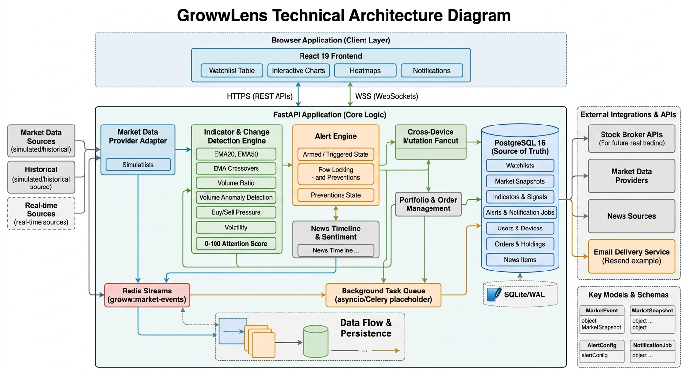

# GrowwLens

## Intelligent market intelligence for traders

GrowwLens is a trader-focused market intelligence terminal that turns a
watchlist into an explanation layer for the market.

Instead of only showing the latest price, GrowwLens helps answer:

- **What changed?**
- **Why did it change?**
- **How significant is it?**
- **Which stocks deserve attention now?**

The product combines live data from the **Groww API** and the **Indian Stock
Market API** with an event-driven analysis engine, persistent watchlists,
technical signals, anomaly detection, alerts, notifications, news context,
charts, heatmaps, and simulated trading.Enriched stock table with **price, daily movement, volume, volume ratio, anomaly state, EMA, buy/sell pressure, sparklines, 52-week range, holdings, and change since addition.**

> GrowwLens is a market-observation and paper-trading product prototype. It
> does not place real broker orders or provide investment advice.
>

## Architecture



## Product capabilities

### Trader workspace

- Persistent multi-watchlist workspace with create, delete, add, remove, and
  pin actions.
- Enriched stock table with price, daily movement, volume, volume ratio,
  anomaly state, EMA, buy/sell pressure, sparklines, 52-week range, holdings,
  and change since addition.
- **What changed?** view comparing current state with the last-seen baseline.
- Market-status and data-quality visibility.
- Interactive stock terminal with chart history and technical context.
- Volume/order-book view and market heatmaps.
- News-to-market reaction timelines.
- Related stocks and sector-peer discovery.
- Simulated buy/sell orders with persisted order and portfolio records.

### Live intelligence

Each update is normalized into a canonical `MarketEvent` and processed through
the same analysis pipeline whether it comes from a live provider or the
simulator.

The analysis layer produces:

- EMA20 and EMA50 trend values.
- Bullish and bearish EMA crossover signals.
- Volume ratio against a proportional baseline.
- Volume-anomaly detection.
- Signed-volume buy and sell pressure.
- Rolling volatility.
- Deterministic 0–100 attention scores.
- Human-readable meaningful-change explanations.

### Alerts and notifications

- Stateful alert lifecycle: `ARMED`, `TRIGGERED`, `COOLDOWN`, and `DISABLED`.
- PostgreSQL row locks for safe concurrent state transitions.
- Idempotency protection through a unique `(alert_id, market_event_id)` key.
- Immediate WebSocket alert delivery and in-app notifications.
- Toast feedback in the terminal.
- Email audit records with optional Resend delivery.
- Race-condition demonstration for duplicate-alert prevention.

## Data integrations

### Groww API

Groww integration supports:

- Quotes and last traded prices.
- OHLC and daily market fields.
- User profile information.
- Holdings and margin data.

### Indian Stock Market API

The Indian Stock Market API enriches the product with:

- Market activity and most-active data.
- News and market context.
- Trending information.
- Sector and peer discovery.

### Reliable demonstration mode

When external provider credentials or live quotes are unavailable, GrowwLens
continues with seeded market snapshots and a built-in simulator. Simulation
mode produces realistic price, volume, indicator, index, alert, and
notification events so the complete product workflow can be demonstrated
without depending on market hours.


### Runtime architecture

```text
┌──────────────────────────────────────────────────────────────┐
│ React + TypeScript trading terminal                         │
│ Watchlists · charts · alerts · heatmaps · news · orders      │
└──────────────────────────────┬───────────────────────────────┘
                               │ REST + WebSocket
                               ▼
┌──────────────────────────────────────────────────────────────┐
│ FastAPI application                                          │
│ REST API · WebSocket gateway · lifecycle orchestration       │
└───────────────┬──────────────────┬───────────────────────────┘
                │                  │
                ▼                  ▼
┌────────────────────────┐  ┌─────────────────────────────────┐
│ PostgreSQL              │  │ Redis Streams                  │
│ Persistent source       │  │ groww:market-events             │
│ of truth + row locks    │  │ Durable event transport         │
└────────────────────────┘  └───────────────┬─────────────────┘
                                            ▼
                              ┌───────────────────────────────┐
                              │ Market event consumer          │
                              │ Change + alert processing      │
                              └───────────────┬───────────────┘
                                              ▼
                              ┌───────────────────────────────┐
                              │ WebSocket broadcast layer       │
                              │ Ticks · changes · notifications │
                              └───────────────────────────────┘
```

### Event lifecycle

1. Groww, Indian Stock Market API, or the simulator produces market data.
2. The provider adapter creates a canonical `MarketEvent`.
3. The event is published to the `groww:market-events` Redis Stream.
4. The consumer invokes the change detector and alert engine.
5. Indicators, attention scores, anomalies, and meaningful changes are created.
6. Alert state, market records, and notifications are persisted.
7. WebSocket events are broadcast to connected browser sessions.
8. The frontend updates matching symbols immediately.

REST remains responsible for the initial watchlist table. WebSocket events
provide live updates after the initial state has loaded.

## Consistency and reliability

PostgreSQL is the preferred persistence layer. Alert transitions use native
database row locks:

```sql
SELECT status
FROM alerts
WHERE id = $1
FOR UPDATE;
```

The database also enforces:

```text
UNIQUE(alert_id, market_event_id)
```

This prevents concurrent workers or duplicate event delivery from creating
duplicate logical alerts.

SQLite/WAL and an in-process queue are explicit fallback modes for offline
development and tests. They are not represented as distributed production
infrastructure.

## Technology stack

| Layer | Technology |
| --- | --- |
| Frontend | React 19, TypeScript, Vite |
| UI | Tailwind CSS, Lucide React |
| Charts | Lightweight Charts |
| Backend | Python, FastAPI, Pydantic, Uvicorn |
| Persistence | PostgreSQL 16, Psycopg 3 |
| Event transport | Redis 7, Redis Streams |
| Integrations | Groww Python SDK, Indian Stock Market API, HTTPX |
| Notifications | WebSocket delivery, optional Resend |
| Fallbacks | SQLite/WAL, asyncio event queue |

## API surface

All REST endpoints use the `/api` prefix.

| Capability | Endpoints |
| --- | --- |
| Health and market | `/system/health`, `/indices`, `/heatmap`, `/heatmap/data` |
| Simulation | `/settings/simulation-mode`, `/simulator/anomaly` |
| Watchlists | `/watchlists`, `/watchlists/{id}/items`, pin/remove actions |
| Change detection | `/what-changed`, `/mark-seen` |
| Stock intelligence | `/stocks/{symbol}`, history, order book, timeline, related, peers |
| News | `/news/feed` |
| Groww | quote, LTP, OHLC, profile, holdings, margin |
| Alerts | `/alerts`, `/alerts/simulate-race` |
| Notifications | `/notifications`, mark-read, emails, devices |
| Paper trading | `/orders` |

`GET /api/watchlists` returns a top-level array of watchlists. Each watchlist
contains `id`, `name`, `is_default`, `items_count`, and enriched stock `items`.

### WebSocket events

The WebSocket gateway delivers:

- `CONNECTED`
- `TICK`
- `WHAT_CHANGED`
- `ALERT_TRIGGERED`
- `CROSS_DEVICE_MUTATION`
- `PONG`

Clients can send `PING` and synchronized mutation messages for connected
device fanout.

## Data model

The relational schema covers:

- Users, devices, and watchlists.
- Watchlist items and last-seen baselines.
- Market snapshots and technical signals.
- Alerts, alert events, and notification jobs.
- In-app notifications.
- News records.
- Simulated orders and portfolio holdings.

The schema is defined in
[`backend/app/db/schema.sql`](backend/app/db/schema.sql).

## Engineering scope

The current implementation deliberately separates working product behavior
from production-hardening work:

- Authentication currently uses a demo account; multi-user authorization is
  not implemented.
- Live provider integrations are optional; simulation and seeded snapshots
  make the experience demonstrable at any time.
- Email delivery runs asynchronously from the API process; a dedicated worker
  is a future production improvement.
- Some news correlations and timelines use deterministic demo data.
- Orders are simulated and persisted; no real broker order is placed.
- Observability, rate-limit governance, secrets management, and a true
  exchange-grade streaming feed remain future production work.

## Project structure

```text
backend/app/
├── api/          REST router and WebSocket gateway
├── core/         configuration, event models, market stream
├── db/           PostgreSQL/SQLite adapter and schema
└── services/     providers, analysis, alerts, notifications, news, peers

frontend/src/
├── components/   terminal UI, tables, charts, alerts, drawers
├── hooks/        WebSocket and interaction hooks
├── api/          API and WebSocket configuration
└── types/        Shared frontend domain types
```

## Documentation

- [`docs/project-status.md`](docs/project-status.md) — implementation audit,
  delivered scope, APIs, data model, and roadmap.
- [`docs/architecture.md`](docs/architecture.md) — architecture details.
- [`docs/failure-scenarios.md`](docs/failure-scenarios.md) — failure and
  consistency scenarios.
- [`docs/implementation_plan.md`](docs/implementation_plan.md) — original
  implementation plan.

## License

GrowwLens is a technical demonstration built for the Groww challenge.
